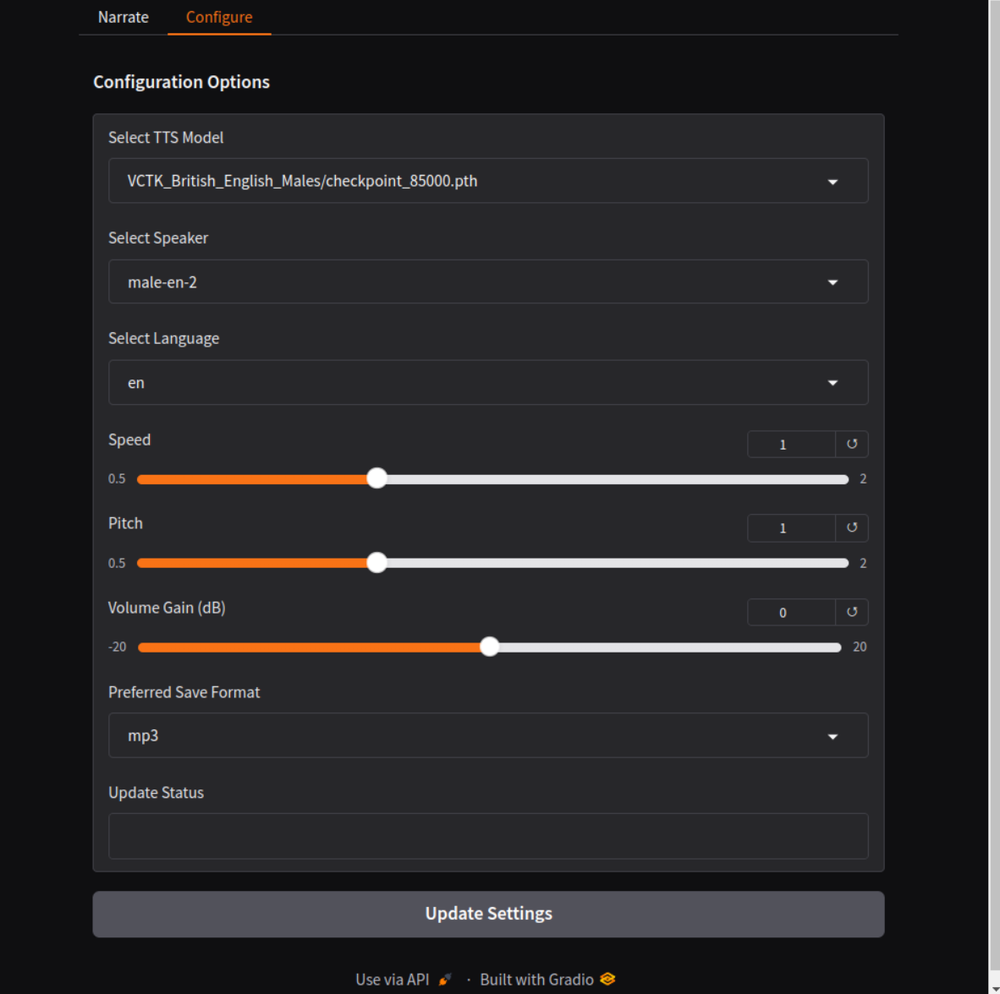

# Tts-Narrate-Gen
Status: Alpha

### Description
Tts-Narrate-Gen is a Gradio-based interface for generating high-quality narrations from text. It utilizes advanced machine learning models from `speechbrain` to convert text into spoken audio, supporting multiple languages and voices. The project is designed to provide a user-friendly interface for generating narrations from sections of text, with support for CUDA-enabled GPUs for accelerated processing.

### FEATURES
- **Gradio Interface**: A web-based interface that allows users to interactively input text and generate narration.
  - **Narrator Page**: Features a single-column text box for user input and buttons to generate, play, and save audio.
  - **Configuration Page**: Allows users to configure TTS parameters, model settings, and view hardware details, with an "Update Settings" button for applying changes.
- **Dynamic Model Support**: Capable of loading and utilizing various TTS models from the `speechbrain` library.
- **CUDA Support**: Optimized for CUDA-enabled GPUs, providing faster audio generation.
- **Multi-Language and Multi-Speaker Support**: Supports generating speech in multiple languages and different speaker voices, making it versatile for various narration needs.
- **Automated File Management**: Manages audio output and settings configuration seamlessly through the interface.

### Preview
The application's interface is divided into two main parts:
- **Narration Interface Page**:


- **Configuration Page**:



- Terminal, Menu and Launch:
```
================================================================================
    Tts-Narrate-Gen - Bash Menu
================================================================================

    1. Launch Tts-Narrate-Gen

    2. Manage Libraries/Files

--------------------------------------------------------------------------------
Selection; Menu Options = 1-2, Exit Program = X: 
```

### Requirements
- **Linux**: Designed for modern Ubuntu/Debian-compatible systems. Tested on Ubuntu 24.
- **Python 3.12**: The project uses Python 3.12. Ensure it is installed on your system.
- **CUDA-Enabled GPU (Optional)**: For faster audio generation, a CUDA-enabled GPU is recommended.
- **TTS Models**: Ensure you have the required TTS models in the `./models` directory. The models should be compatible with `speechbrain`.

### Usage
1. Installation - Download the latest release and unpack it in a suitable directory.
2. Setting Executable - Ensure bash script is executable, right click properties enable or `chmod +x Tts-Narrate-Gen.sh`.
3. Running the Install run `sudo ./Tts-Narrate-Gen.sh`, then select `2` from the menu, ensuring to allow internet access...
- If you do not have Python 3.11.9 installed, then you must then select `1` on the submenu to install Python 3.11.9 in the system, if its already installed it will tell you and return to menu. 
- If/when you have python 3.11.9 installed, then select `2` from the submenu, to, install the program requirements in `./venv` and unpack the program.
4. After installing, requirements and program, ensure the Voice model folders containing `.pth` files to `./models` for example `./models/VCTK_British_English_Males`. 
5. On main menu in bash you may now select `1` from the main menu, this will runn the program script, and then open web interface at `http://127.0.0.1:7860`.
4. In the program, ensure to configure appropriately on `Configure` page, including selecting model folder location, then click `Update Settings`.
5. On `Narrate` page, Enter text into the editable text box, then click `Generate Narration`, then play narration, and save it if you like. 
5. Exit program via clicking on `Exit Program` in web viewer, then return to terminal, where it exits gracefully.
- For, hardware change and development, option `3. Remove Installation` results in remove installation, excluding, `./models` and `./output`, amd them select option `2` after to re-install.  

### Notation
- TTS libraries, failed implementations: TTS and Corqui-TTS, required Python ~3.11. Py3-TTS turned out to be oldschool tts.


### File Structure
- 5 Scripts...
```
./
├── Tts-Narrate-Gen.sh        # Main Bash launcher script
├── main_script.py            # Main program script
├── scripts/
│   ├── interface.py        # Gradio Interface
│   ├── generate.py         # Model Handling
│   ├── utility.py          # All other functions
```

## File Created
- Files created by installer...
```
./
├── data/
│   ├── persistent.yaml       # Stores user settings and configurations
├── venv/
│   ├── *.*                   # Libraries & Tools installed here
├── models/                    # Directory to place model folders
├── output/                   # Directory for generated audio files
└── README.md                 # Project documentation
```

### Development
- Testing, Bugfixing, Improvement.
- Plan image generation, there would be required a rotation between, audio and image, for files to be named in, serial and parrallel, in `./output` folder. The idea is to be able to then throw the matching audio/images into video editing software. Possibly the images and audio could also have the length of the duration of the audio to be written into the labels, to enable better syncronization with batch processing code, soes for program to know how long to show each image, it would have to be seconds and split seconds ./output`A####_T####.mp3/wav` for audio where `Audio #### _ Time ##:## . extension`, while images would be `I####_T####.png/jpg` where `Image #### _ Time ##:## . extension`. 
- there would need to be a format of file for input...
```
0000,"Example text, intended to be narrated.", "Words or Phrases, separated, by commas, for, image generation."
0001, "Example text, intended to be narrated.", "Words or Phrases, separated, by commas, for, image generation."
0002, "Example text, intended to be narrated.", "Words or Phrases, separated, by commas, for, image generation."
0003, "Example text, intended to be narrated.", "Words or Phrases, separated, by commas, for, image generation."
...
Etc...
```
- Develop correct format of script to input for movie contents generation, and naming scheme. Ie, `###;example narration text, with commas, ending in full stop.; image description, words or phrases, with commas, ending in, full stop.`.
- Testing and fixing
- Completion, inc update page.
- Interesting Libraries for later consideration; Nemo2.0 `https://docs.nvidia.com/nemo-framework/user-guide/latest/nemo-2.0/index.html` (state of the art Nemo-thing). Rad-TTS `https://github.com/NVIDIA/radtts` (speech synthasis with its own model https://drive.google.com/file/d/1Rb2VMUwQahGrnpFSlAhCPh7OpDN3xgOr/view?usp=sharing). TensorRT (up to 6x accelleration).

### Credits
- Voices on Huggingface [Voices](https://huggingface.co/voices) 
- Other stuff will be credited later.

## DISCLAIMER:
This project is currently in Alpha. Features and functionalities are subject to change as development progresses.
