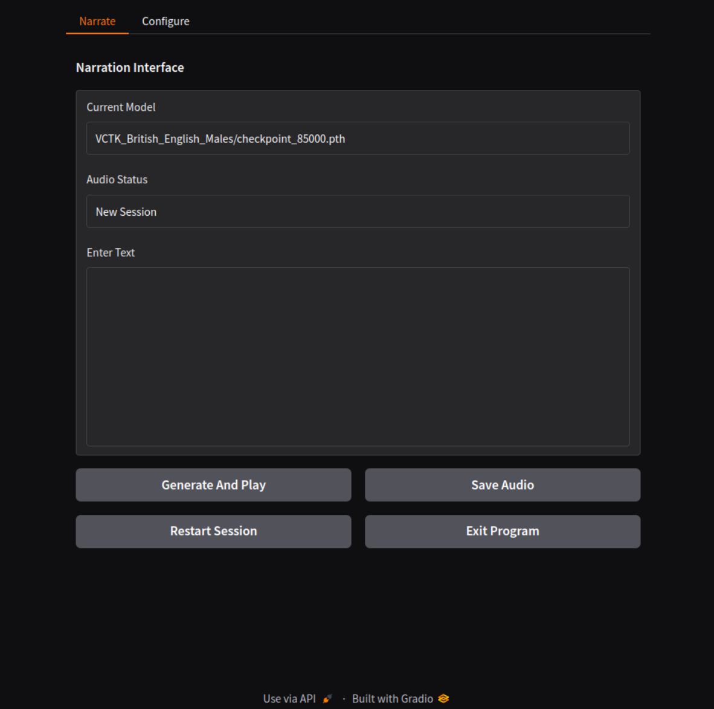

# Tts-Narrate-Gen
Status: Alpha

### Description
The project is being worked through, but currently a bit of nightmare with the TTS libraries repeatingly being for python 3.11. The intent is to offer a Gradio-based interface for generating narrations based video contents. It utilizes advanced machine learning models to convert text into spoken audio, supporting multiple languages and voices. Tts-Narrate-Gen is designed to provide a user-friendly interface for generating narrations from sections of text. The readme.md is still also being setup, and will be somewhat innacurate as the project evolves, and parts need updating.

### FEATURES
- **Gradio Interface**: A web-based interface that allows users to interactively input text and generate narration.
  - **Narrator Page**: Features a single-column text box for user input and three buttons: "Gen Sample", "Play Narrate", and "Save As MP3".
  - **Configuration Page**: Allows users to configure TTS parameters, model settings, and view hardware details, with an "Update Settings" button for applying changes.
- **Dynamic Model Support**: Capable of loading and utilizing various TTS models on HuggingFace, specifically I will intent to be using the ones here [Voices](https://huggingface.co/voices), that seem to have a wide enough range.
- **Multi-Language and Multi-Speaker Support**: Supports generating speech in multiple languages and different speaker voices, making it versatile for various narration needs.
- **Automated File Management**: Manages audio output and settings configuration seamlessly through the interface.

### Preview
The application's interface is divided into two main parts:
- **Narration Interface Page**:



- **Configuration Page**:


- Terminal, Menu and Launch:
```
================================================================================
    Tts-Narrate-Gen - Bash Menu
================================================================================

    1. Launch Tts-Narrate-Gen

    2. Check/Manage Libraries/Files

--------------------------------------------------------------------------------
Selection; Menu Options = 1-2, Exit Program = X: 
```

### Requirements
- Linux - Designed for modern Ubuntu/Debian compatible, im specifically using Ubuntu 24.
- Python3 - It uses modern Python, libraries are installed to the VEnv at `./venv`, and requriemts is at `./data/requirements.txt`.
- TTS Models - Programmed towards [Voices](https://huggingface.co/voices), ensure strictly to use `lfs` when you are clone. 

### Usage
1. Installation - Download the latest release and unpack it in a suitable directory.
2. Setting Executable - Ensure bash script is executable, right click properties enable or `chmod +x Tts-Narrate-Gen.sh`.
3. Running the Install run `sudo ./Tts-Narrate-Gen.sh`, then select `2` from the menu, ensuring to allow internet access...
- If you do not have Python 3.11.9 installed, then you must then select `1` on the submenu to install Python 3.11.9 in the system, if its already installed it will tell you and return to menu. 
- If/when you have python 3.11.9 installed, then select `2` from the submenu, to, install the program requirements in `./venv` and unpack the program.
4. After installing, requirements and program, ensure the Voice model folders containing `.pth` files to `./models` for example `./models/VCTK_British_English_Males`. 
5. On main menu in bash you may now select `1` from the main menu, this will runn the program script, and then open web interface at `http://127.0.0.1:7860`.
4. In the program, ensure to configure appropriately on `Configure` page, including selecting model folder location, then click `Update Settings`.
5. On `Narrate` page, Enter text into the editable text box, then click `Generate Narration`, then play narration, and save it if you like. 
5. Exit program via clicking on `Exit Program` in web viewer, then return to terminal, where it exits gracefully.
- For, hardware change and development, option `3. Remove Installation` results in remove installation, excluding, `./models` and `./output`, amd them select option `2` after to re-install.  

### Notation
- TTS Required Python ~3.11, and had no version for ~3.12 at the time of creation of my project, hence, there is my first linux installer that also installs python.

### File Structure
- 5 Scripts...
```
./
├── Tts-Narrate-Gen.sh        # Main Bash launcher script
├── main_script.py            # Main program script
├── scripts/
│   ├── interface.py        # Gradio Interface
│   ├── generate.py         # Model Handling
│   ├── utility.py          # All other functions
```

## File Created
- Files created by installer...
```
./
├── data/
│   ├── persistent.yaml       # Stores user settings and configurations
├── venv/
│   ├── *.*                   # Libraries & Tools installed here
├── models/                    # Directory to place model folders
├── output/                   # Directory for generated audio files
└── README.md                 # Project documentation
```

### Development
- TTS AND Corqui-TTS, was limited to Python 3.11, ended in non-progressive issues and complexity. Now using Py3-TTS, as 3.12 compatible.
- Continue to develop interface to take advantage of all useful Voices model config features.
- Integrate image generation, intended to work along-side audio generation; if I can figure out the processing speed of each, then dynamically assign appropriate proportion of threads to, images and audio, things will happen at roughly the same time.
- Develop correct format of script to input for movie contents generation, and naming scheme. Ie, `###;example narration text, with commas, ending in full stop.; image description, words or phrases, with commas, ending in, full stop.`.
- Testing and fixing
- Completion, inc update page.

### Credits
- Voices on Huggingface [Voices](https://huggingface.co/voices) 
- Other stuff will be credited later.

## DISCLAIMER:
This project is currently in Alpha. Features and functionalities are subject to change as development progresses.
